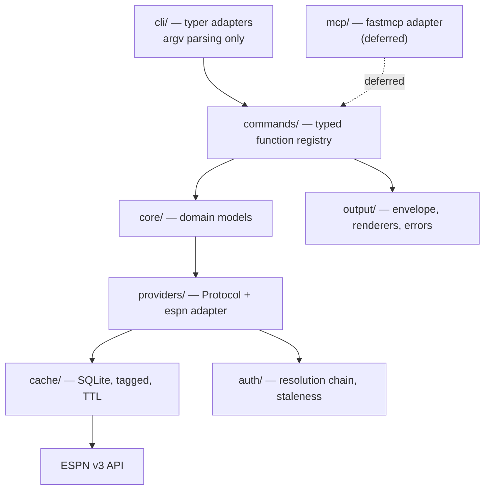
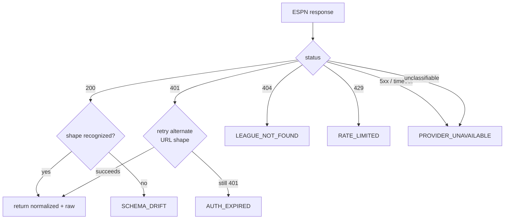
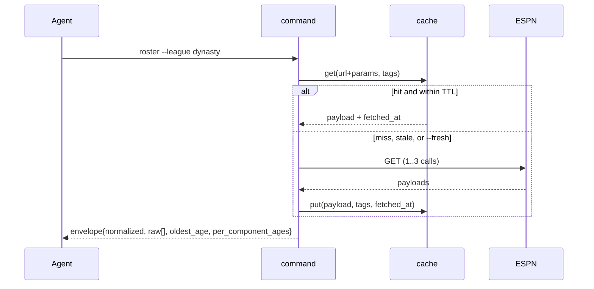

# feat: Agent-managed ESPN fantasy CLI

## Summary

Build the read path of `fantasy-sports` end to end — package, provider layer,
credentials, output contract, cache, read commands, drift detection, and an
offline test harness — and run the research spike that makes writes plannable.
Write implementation is deliberately excluded: the ESPN library cannot write and
the mutation surface is unresearched.

---

## Problem Frame

John runs several ESPN fantasy leagues and wants his agents to see and manage
them on his behalf across a season. No maintained CLI exists, and every prior
attempt died the same way — ESPN changed its unofficial API, nobody noticed for
months, the repo went quiet.

Two facts constrain this plan more than anything in the origin document.

**`espn-api` is read-only.** Verified 2026-08-26 against the installed package:
every live call is a `GET` against `lm-api-reads.fantasy.espn.com`, and the only
`post` calls sit inside a commented-out dead authentication method. No research
covers ESPN's write host, transaction payload, headers, or rejection vocabulary.

**The write surface is therefore unplannable today.** Authoring write units now
would produce fiction the spike overturns. The honest plan builds everything that
does not depend on writing, and treats the spike as the gate.

---

## Requirements

Traced to `docs/brainstorms/2026-08-26-agent-managed-fantasy-leagues-requirements.md`.
Origin IDs are cited on the units that advance them.

**In scope for this plan**

- R1, R1a — raw passthrough keyed by request; untrusted-text labeling
- R2, R3, R3a — legible normalization; agent-sufficient read context
- R4, R5 — data-age reporting; guaranteed-fresh reads
- R10 — tagged cache entries. The tagging lands here; the purge-on-write half is
  exercised when writes land.
- R11, R12, R12a — versioned envelope; error taxonomy; credential staleness
- R13, R13a — agent-complete help; multi-league enumeration and targeting
- R14 — published performance and test budgets from first release

**Actors and acceptance examples**

The origin's actors carry into the plan implicitly: the agent is the primary
consumer, which is why the output contract, help text, and error taxonomy are
written for machine consumption; John is the auditor, which is why the journal
records attribution; ESPN is an unreliable third party, which is why drift
detection is core. Of the origin's six acceptance examples, three are exercised by
this plan's test scenarios (data-age and fresh-read, credential distinguishability,
normalized-plus-raw). The other three — read-back verification, journal and
reversal, dry-run — all describe write behavior and are blocked on U11.

**Carried but not satisfied by this plan**

- R6 — explicit target state for writes. Blocked on U11.
- R7, R7a — mutation journal with attribution; surfacing irreversible writes. Blocked on U11.
- R8, R8a — scoped reversibility; pre-action calibration check on the irreversible
  class. Blocked on U11.
- R9, R9a — dry-run semantics; provider rejection reasons as machine codes.
  Blocked on U11.
- R15 — no public release before reads *and* writes work. Gates the release unit.

---

## Key Technical Decisions

**KTD1 — Writes are a research spike plus a gated stub, not implementation
units.** `espn-api` has no write path and the ESPN mutation surface is
undocumented. U11 produces the brief; write units get authored in a follow-up
plan once it lands. Speculating a design now trades a known gap for an unknown
wrong answer.

*This does not reinstate a read-only release.* ADR-0006 as amended makes writes
core scope, and R15 still gates public release on reads **and** writes working.
What is deferred is the *authoring of write units*, not the commitment to ship
them — the surface must be known before work on it can be estimated.

**KTD2 — The dependency ceiling moves to six now and seven when writes land.**
ADR-0008 capped direct runtime dependencies at five and counted `requests` as
free because it arrives transitively through `espn-api`. This plan adds exactly
one: `packaging`, for PEP 440 comparison in the health check. `platformdirs` is
dropped per ADR-0008 and KTD6.

**This plan's set is six or seven.** Six are certain: `espn-api`, `typer`, `rich`,
`tomli-w`, `keyring`, `packaging`. `requests` becomes the seventh the moment U7
exercises KTD10's direct-HTTP fallback for a view `espn-api` does not cover — which
is likely but not yet known. Writes make it certain regardless, since `espn-api`
exposes no reusable session.

Amend ADR-0008 to seven, conditioned on that fallback. Note that `packaging` is
required by the client health check's PEP 440 comparison, which traces to ADR-0005
rather than to an origin requirement — the origin never asked for a self-upgrade
nudge. That is a deliberate carry-forward of an accepted decision, not an
untraced feature, and it is called out here so the traceability gap is visible
rather than silent.

**KTD10 — Wrap `espn-api` for reads; drop to direct HTTP only where it lacks
coverage.** The library is years of accumulated knowledge about an undocumented
API and absorbs ESPN's read-side changes on our behalf. The rejected alternative
is direct HTTP throughout, which would buy uniformity with the write path we must
hand-roll anyway — but it discards the library's view handling, ID maps, and the
2024 base-URL migration, and it leaves us diagnosing every read break from scratch
with no upstream issue tracker to check first. The Provider Protocol contains the
coupling, so replacing the library later is a contained change.

**KTD3 — Cache at a named transport seam, keyed on URL + params + a canonical
hash of request-scoping headers, tagged by sport, league, season, and scoring
period.** Composite calls fan out with no internal dedup, so caching at the command
layer still pays every round trip. Three corrections over the obvious design, each
of which would otherwise ship a silent data-corruption bug:

*The key must include headers.* ESPN's filters live in an `x-fantasy-filter`
**header**, not the query string. `free-agents --pos WR` and `--pos RB` produce
byte-identical URL and params, so a URL-keyed cache serves one in answer to the
other, inside TTL, with a valid envelope and correct data age.

*TTL is the minimum over the views in the entry.* `get_league()` fetches `mTeam`,
`mRoster`, `mMatchup`, `mSettings`, and `mStandings` in one request, so one entry
spans four resource classes and can hold only one TTL. It takes the shortest —
roster cadence. Consequence accepted: settings re-fetch far more often than their
nominal one-day TTL.

*The tag tuple includes sport.* ESPN league ids are unique only within a sport, so
two profiles can share id `1234`. Without it, a football write purges the
basketball league's entries.

**KTD3a — The seam is an injected `requests.Session`, load-bearing for four
requirements.** `espn-api` performs every call inside `league_get()` and returns
parsed JSON or a status-derived exception that discards the status code and
headers. Wrapping the library (KTD10) therefore forecloses exactly what URL-level
caching, 429 detection, `Retry-After`, and R4's per-component `fetched_at` all
require. We install our own `Session` on the library's request object and intercept
there. Not an implementation detail — it is the single point four requirements
depend on.

**KTD11 — `--week` means scoring period on every read command.** Scoring and
matchup periods diverge exactly during multi-week playoff rounds, a per-league
setting. A command needing the enclosing matchup resolves it via `matchup_periods`
rather than reinterpreting the flag. Pinning it now matters because the divergence
bites only in December, and a fixture from a single-week-playoff league passes under
either interpretation.

**KTD4 — A guaranteed-fresh read refreshes the cache as a side effect.** One
fresh call then benefits the calls after it within TTL. Pure bypass would force an
agent to re-fetch on every subsequent call in the same reasoning pass. Resolves an
origin open question.

**KTD5 — The mutation journal is append-only JSONL, one file per league, never
auto-pruned.** Volume across a season is small, and silent pruning would break the
audit trail the journal exists to provide. Resolves an origin open question. The
journal ships in the write follow-up; the path and format are pinned here so the
read-side cache and config layers can reserve the location.

**KTD6 — Force XDG paths on every platform.** `platformdirs` returns
`~/Library/Application Support` on macOS, which conflicts with the paths the
architecture commits to. Technical-audience CLIs behave the XDG way; a small
internal helper replaces the dependency.

**KTD7 — Lazy imports are structural, not stylistic.** Nothing heavy at module
scope. Enforced by a test asserting the heavy modules are absent from `sys.modules`
after importing the entry point, because a code-review convention will not hold.

**KTD8 — Unit tests have no network at all.** `pytest-socket` blocks it, so a
cassette miss fails loudly instead of silently calling ESPN and making the suite
quietly dependent on ESPN being up.

**KTD9 — Drift detection and its manifest ship in the core read path.** Detection
notices ESPN changed shape before a decision is made against broken data, which is
John's exposure. The manifest ships with it, because the client-side check has
nothing to read without one. **Only auto-filed issues are deferred** — a red
scheduled run is sufficient signal for a solo operator, and issue-filing is
release-audience machinery.

---

## High-Level Technical Design

### Layering

Commands are typed functions in a registry; the CLI and the future MCP server are
both thin projections over it. Nothing in `commands/` imports `typer`.



`core/` and `providers/` carry zero LLM dependency. Only a future `reports/`
layer may call a model.

### Error classification

A bare 401 is ambiguous between expired credentials and a wrong
current-versus-historical URL shape. Classifying naively sends the user to
re-extract credentials that were never the problem.



Unclassifiable failures map to availability with bounded retry, never to
throttling — ESPN's throttle signal is unconfirmed.

### Read path with cache and freshness



---

## Output Structure

```
src/fantasy_sports/
  __init__.py
  cli/
    app.py            # typer wiring only
    context.py        # global options
    render.py         # TTY detection, format dispatch
  commands/
    __init__.py       # REGISTRY
    league.py  roster.py  matchups.py  transactions.py
    free_agents.py  raw.py  auth.py  doctor.py
  core/
    models.py  errors.py
  providers/
    base.py           # Protocol
    espn.py
  auth/
    chain.py  staleness.py
  cache/
    store.py  tags.py
  config/
    paths.py  leagues.py
  output/
    envelope.py  json.py  table.py  csv.py
  health/
    check.py  manifest.py
tests/
  conftest.py
  cassettes/
  unit/  integration/  live/
```

Directional. Per-unit file lists are authoritative.

---

## Implementation Units

### Phase 1 — Foundation

### U1. Package scaffolding, toolchain, and CI

**Goal:** A working package with both entry points, lint, type-check, and CI.

**Requirements:** R14 · **Tracks:** issue #2 · **Dependencies:** none

**Files:** `pyproject.toml`, `src/fantasy_sports/__init__.py`,
`src/fantasy_sports/cli/app.py`, `.github/workflows/ci.yml`, `tests/conftest.py`,
`tests/unit/test_imports.py`

**Approach:** Copy the validated `pyproject.toml` from
`docs/research/04-python-cli-packaging.md`, adjusted per KTD2 (drop
`platformdirs`, add `tomli-w`) and KTD6. Two console scripts. PEP 735
`[dependency-groups]` for dev tooling. Package layout per Output Structure, with
`commands/` typer-free from the first commit.

**Patterns to follow:** `docs/research/04-python-cli-packaging.md` §1, §3, §7.

**Test scenarios:**
- `--version` prints the installed version and exits zero
- `--help` lists registered command groups
- Importing the entry point leaves `espn_api`, `requests`, `rich.table`, and
  `keyring` absent from `sys.modules` (KTD7)
- `pytest-socket` blocks an outbound connection attempt in a unit test (KTD8)
- CI passes on 3.12, 3.13, and 3.14

**Budget enforcement lands here, not later.** R14 says the budgets hold from first
release, so CI carries them from U1: `hyperfine` cold-start against a committed
baseline, coverage as a hard fail, a wheel-size check, and a direct-dependency
count. The mutation-score gate runs on a schedule rather than per-PR. Without this,
R14 is traced but unmet and the lazy-import rule has no enforcement beyond a
`sys.modules` assertion that cannot detect a slow-but-lazy import.

**Verification:** `uv sync` produces a working env; `uv run fantasy-sports --help`
succeeds; CI green with every budget check active.

### U2. Core models and Provider Protocol

**Goal:** The domain contract every adapter satisfies, plus the error taxonomy
those models raise. `core/errors.py` lands here rather than with the output layer
because U2's own acceptance test requires the schema-drift error and the output
layer depends on U2 — putting the taxonomy downstream makes U2 unlandable.

**Requirements:** R2 · **Tracks:** #3 · **Dependencies:** U1

**Files:** `src/fantasy_sports/core/models.py`, `src/fantasy_sports/core/errors.py`,
`src/fantasy_sports/providers/base.py`, `tests/unit/test_models.py`,
`tests/unit/test_errors.py`

**Approach:** Frozen dataclasses for League, Team, Player, RosterSlot, Matchup,
Transaction, FreeAgent. Every model carries `provider`, `provider_id`, and `raw`.
`Team.owner_names` is a list — ESPN supports co-managers. Both scoring-period and
matchup-period identifiers preserved in `raw`. Slot eligibility **is** modelled
per origin R3, superseding the architecture finding that excluded it.
`providers/base.py` defines a `typing.Protocol`, validated on paper against
Sleeper and Yahoo shapes so it does not encode ESPN-only assumptions.

**Patterns to follow:** `docs/research/02-provider-data-shapes.md` §5 Protocol and
§6 warnings.

**Test scenarios:**
- Every model constructs from a fixture dict and round-trips `raw` unmodified
- A team with two owners preserves both names
- A Protocol-conformance stub satisfies `isinstance` checks under `runtime_checkable`
- Constructing a model with a missing required key raises the project's
  schema-drift error, not a bare `KeyError`

**Verification:** Models construct from fixtures; a fake provider satisfies the
Protocol.

### U3. Config, paths, and multi-league resolution

**Goal:** Named league profiles an agent can enumerate and target per command.

**Requirements:** R13a · **Tracks:** #7 · **Dependencies:** U1

**Files:** `src/fantasy_sports/config/paths.py`,
`src/fantasy_sports/config/leagues.py`, `tests/unit/test_config.py`

**Approach:** XDG paths forced on every platform per KTD6 — roughly fifteen lines,
no `platformdirs`. TOML read via stdlib `tomllib`, written via `tomli-w`. Named
profiles with provider, league id, season, sport, plus a default. `--league` and
`--season` as global options.

**Test scenarios:**
- Config resolves to `~/.config/fantasy-sports/` on macOS, not `~/Library/...`
- `XDG_CONFIG_HOME` overrides when set
- A named league resolves; an unknown one raises `LEAGUE_NOT_FOUND`
- Enumerating leagues returns every configured profile without mutating config
- `--season` overrides the profile's season for one invocation

**Verification:** Two profiles configured; each targetable without editing config.

### U13. Scrub-before-write recording hook

**Goal:** Make it impossible to write an unscrubbed cassette to disk.

**Requirements:** R14 · **Tracks:** #12 · **Dependencies:** U1

**Files:** `tests/conftest.py`, `tests/unit/test_scrubbing.py`

**Approach:** The minimal half of the cassette harness, pulled ahead of every unit
that records. Scrub cookies, auth headers, `espn_s2` and SWID query params, and
SWID GUIDs echoed in response bodies — ESPN returns owner SWIDs inline in roster
payloads, so header filtering alone does not catch it. A repo-wide scan test
asserts no committed fixture matches a credential pattern. U9 builds the rest of
the harness later; this piece cannot wait, because U7 records against a real
private league.

**Execution note:** Write the scan test first. This is a security control.

**Test scenarios:**
- A recorded interaction containing a cookie header writes to disk with the value
  replaced, not merely omitted from assertions
- An `espn_s2` or SWID query parameter is scrubbed from the request URI
- A SWID GUID echoed in a response body is redacted (header filtering misses this)
- The repo-wide scan fails loudly when handed a fixture containing a credential
  pattern, and passes on the committed tree
- Re-recording an existing fixture re-applies scrubbing rather than trusting the
  prior pass

**Verification:** The scan test passes against the committed tree and demonstrably
fails against a deliberately poisoned fixture.

### Phase 2 — Provider and data

### U4. Credential resolution and staleness reporting

**Goal:** Credentials resolved safely, with expiry visible *before* a deadline.

**Requirements:** R12a · **Supports:** F1, F2 (credential validity gates both) ·
**Tracks:** #5 · **Dependencies:** U1

**Files:** `src/fantasy_sports/auth/chain.py`,
`src/fantasy_sports/auth/staleness.py`, `tests/unit/test_auth.py`

**Approach:** Resolution order env → macOS Keychain → config file. Env first is
non-negotiable: cron and CI cannot reach the Keychain. `auth login` guides
extraction and validates the SWID brace format, the single most-repeated manual
mistake. `auth status` reports presence **and age**, warning as the credential
approaches its expected lifetime.

**Execution note:** Write the redaction test first — it is a security control.

**Test scenarios:**
- Env beats Keychain beats config file
- A Keychain read failure under a locked keychain falls through to config rather
  than raising
- SWID missing braces is repaired on save; a malformed value is rejected
- Credential values never appear in rendered errors, log output, or tracebacks
- `auth status` reports age and flags a credential past its expected lifetime
- Absent credentials produce `AUTH_MISSING`, not a crash

**Verification:** `auth status` reports age against a real credential; the
redaction test passes.

### U5. Output layer: envelope, renderers, error taxonomy

**Goal:** The versioned contract every consumer parses.

**Requirements:** R11, R12, R13 · **Tracks:** #6 · **Dependencies:** U2

**Files:** `src/fantasy_sports/output/envelope.py`, `output/json.py`,
`output/table.py`, `output/csv.py`, `tests/unit/test_output.py`

**Approach:** Every success wraps in a versioned envelope carrying provider,
league, season, generation timestamp, and data-age fields. JSON when stdout is not
a TTY, rich table when it is, CSV on request, with `--output` overriding
detection. Errors to stderr as JSON with a stable machine code and nonzero exit.
Timestamps re-derived from raw epoch values — `espn-api`'s datetimes are naive and
host-local and would silently corrupt the envelope.

**Test scenarios:**
- Piped invocation emits JSON; TTY emits a table; `--output` overrides both
- The envelope carries `schema`, `provider`, `league_id`, `season`, `generated_at`
- Covers AE5. Each taxonomy code has a test that produces it and asserts the exit
  status; credential, availability, and throttling causes are mutually distinguishable
- An unclassifiable failure maps to availability, never to throttling
- Timestamps render as UTC regardless of host timezone
- Error payloads go to stderr; stdout stays empty on failure

**Verification:** Golden files per renderer; every error code exercised.

### U6. HTTP-layer cache with tagged entries

**Goal:** A cache that is fast and that a write can later invalidate correctly.

**Requirements:** R5, R10 · **Tracks:** #8 · **Dependencies:** U13, U2

**Files:** `src/fantasy_sports/cache/store.py`, `cache/tags.py`,
`tests/unit/test_cache.py`

**Approach:** SQLite in the XDG cache dir, keyed on URL plus params, decorating the
provider rather than the command layer (KTD3). Every entry tagged with league,
season, and scoring period. TTL by resource type. A fresh read refreshes the entry
(KTD4). Purge-by-tag exists now even though writes call it later.

Response bodies are redacted before they are written to the store, reusing U13's
helper. ESPN echoes owner SWIDs inline in roster payloads, and completed weeks and
historical seasons cache **forever** — an unredacted body would sit unencrypted in
the cache directory indefinitely.

**Test scenarios:**
- A repeat call inside TTL hits the cache; outside TTL refetches
- A composite call sharing a sub-request with another command hits on the shared part
- Covers AE1. `--fresh` bypasses **and** updates the entry, so the next call hits
- `--no-cache` bypasses without writing
- Purge-by-tag removes matching entries and leaves others
- A corrupt cache file degrades to a live fetch rather than raising
- A response body containing an echoed SWID is redacted *before* the store write,
  verified by reading the stored row rather than the returned value
- Credentials never appear in cached payloads

**Verification:** Cache hit measurably faster; purge-by-tag scoped correctly.

### U7. ESPN provider adapter (reads)

**Goal:** The one provider that ships, with honest error classification.

**Requirements:** R1, R2, R3, R3a, R4 · **Tracks:** #4 · **Dependencies:** U13, U2, U4, U6

**Files:** `src/fantasy_sports/providers/espn.py`,
`tests/unit/test_espn_provider.py`, `tests/cassettes/espn/*.yaml`

**Approach:** Wrap `espn-api`; drop to direct requests only where it lacks
coverage. Return every contributing upstream response keyed by request (R1) —
composite calls fan out and a single payload would drop data. Validate response
shape enough to raise schema-drift rather than letting `KeyError` escape; the
library offers no typed exception for this and every constructor does unguarded
dict access. Wrap **every** library call site in a catch-all mapping unrecognized exceptions to
`PROVIDER_UNAVAILABLE` — `espn-api` raises bare `Exception` on ordinary conditions,
including `'No transactions found'` for an empty scoring period, which is a
successful empty result rather than an error.

**The 401 alternate-shape probe is library-owned.** `checkRequestStatus` already
swaps `/leagueHistory/` for `/seasons/` and retries before raising, so our code
never observes a bare 401; re-implementing it doubles the request cost against a
provider whose throttle behaviour is unconfirmed. Map `ESPNAccessDenied` to
`AUTH_EXPIRED`, or `AUTH_MISSING` when no cookies were supplied. Read `Retry-After`
at the transport seam (KTD3a) — the only place the header survives. Surface slot eligibility, current slot, kickoff time,
and lock state (R3).

**Execution note:** Record cassettes before writing assertions. Scrubbing already
exists — U13 is a hard dependency precisely so no unscrubbed fixture can reach disk.

**Test scenarios:**
- Covers AE6. Each read method returns normalized output plus every contributing
  raw response
- A payload missing an expected key raises schema-drift with the offending path
- A 401 that succeeds on the alternate URL shape returns data, not `AUTH_EXPIRED`
- A 401 failing both shapes raises `AUTH_EXPIRED`
- Scoring-period and matchup-period values both preserved and distinguishable
- Naive library datetimes converted correctly; no host-timezone leakage
- A private league with valid credentials returns data; without them, `AUTH_MISSING`
- Any exception raised by `espn-api` is caught and re-raised as our own typed error
  with credential-shaped substrings stripped — the library interpolated `espn_s2`
  into its access-denied message until a 2026-02 fix, so passing its text through
  verbatim is a known leak path

**Verification:** All read methods pass against cassettes; live smoke against a
real league succeeds.

### Phase 3 — Surface

### U12. Untrusted-text labeling

**Goal:** Give agents a documented seam against prompt injection.

**Requirements:** R1a · **Tracks:** #17 · **Dependencies:** U5, U7

**Files:** `src/fantasy_sports/output/envelope.py`,
`src/fantasy_sports/providers/espn.py`, `tests/unit/test_untrusted.py`

**Approach:** Team and league names, trade notes, waiver and offer comments, and
message-board content are attacker-influenceable — any league member sets them, and
they reach an agent that can write. Label them distinctly from normalized
structured fields in the envelope. Anywhere untrusted text renders into markdown,
use indented code blocks, which have no fence terminator hostile input can close.

**Test scenarios:**
- A team name containing injection-shaped text is labeled untrusted, not merged
  into structured fields
- Triple backticks and an `@mention` in a team name cannot escape their container
  in any output surface
- Labeling survives both JSON and table rendering
- Normalized structured fields are never labeled untrusted

**Verification:** A crafted team name renders contained in every surface.

### U8. Read commands

**Goal:** What a user or agent actually types.

**Requirements:** R1, R3, R4, R5, R13, R13a · **Realizes:** F1 (agent answers a
question about the team) · **Tracks:** #9 · **Dependencies:** U3, U5, U7, U12

**Files:** `src/fantasy_sports/commands/league.py`, `roster.py`, `matchups.py`,
`transactions.py`, `free_agents.py`, `raw.py`, `commands/__init__.py`,
`src/fantasy_sports/cli/app.py`, `tests/unit/test_commands.py`,
`tests/integration/test_cli.py`

**Approach:** `league info`, `teams`, `standings`, `roster`, `matchups`,
`transactions`, `free-agents`, `raw`. Every command a plain typed function in the
registry; typer callbacks parse and delegate only. `raw --view` accepts repeated views and passes through unmodified, and takes
`--filter` to supply an `x-fantasy-filter` header. Several views are incomplete
without one — ESPN returns a default subset with a 200 rather than erroring, which
`raw` would otherwise present to an agent as authoritative provenance. Help text written for an agent reading
`--help` as its only documentation. Standings tiebreakers live in the ESPN adapter,
not `core/` — ESPN returns no sorted standings and Yahoo would disagree with a
shared algorithm.

**Test scenarios:**
- Each command returns correct data in both table and JSON modes
- `roster --team` accepts an id and a name
- Against a fixture whose `matchup_periods` maps a playoff round to two scoring
  periods, `matchups --week` on the second returns that round's schedule entry and
  the requested period's stats (KTD11)
- `free-agents --pos --limit` filters and bounds correctly
- `transactions --limit` walks scoring periods backward from the current one under
  a stated cap on upstream calls, and the envelope reports every contributing
  request with the oldest age across them
- `raw --view` repeated returns each view's payload unmodified
- `raw --view kona_player_info` without `--filter` is rejected or labeled unfiltered
  in the envelope — never presented as an authoritative result
- Every command honors `--league`, `--season`, `--fresh`, `--no-cache`
- No command module imports `typer` (KTD7 boundary)
- `CliRunner` asserts exact JSON envelope shape per command
- A provider raising credential-expired surfaces that machine code and a nonzero
  exit, with stdout empty — not a traceback
- A provider raising schema-drift propagates the offending path into the error
  payload rather than being swallowed as a generic failure
- An unknown `--league` fails before any network call is attempted
- A cache hit and a live fetch produce byte-identical envelopes apart from the
  age fields, proving the cache decorator is transparent to the command layer
- A command whose provider call fans out to three ESPN requests reports all three
  in raw and the oldest age in the envelope (crosses command, provider, and cache)

**Verification:** Every command works against a real private league in both modes.

### U9. Cassette harness with credential scrubbing

**Goal:** Offline, deterministic tests that cannot leak an ESPN session.

**Requirements:** R14 · **Tracks:** #12 · **Dependencies:** U13, U7

**Files:** `tests/conftest.py`, `tests/cassettes/`, `docs/testing.md`

**Approach:** The remainder of the harness, on top of U13's scrubbing hook.
`pytest-recording` over `vcrpy`, `pytest-socket` blocking network in unit tests, a
`live` marker excluding credentialed tests from default runs, and the re-recording
procedure documented.

**Test scenarios:**
- A cassette miss raises rather than performing a live call
- `pytest -m "not live"` runs fully offline with no network access
- The `live` marker is excluded from the default selection
- Documented re-record procedure produces a scrubbed fixture end to end

**Verification:** Offline CI passes with network disabled; the scan test passes.

### U10. Client health check and doctor

**Goal:** Turn an upstream break into actionable guidance instead of a stack trace.

**Requirements:** R12 (carries ADR-0005) · **Tracks:** #10 · **Dependencies:** U5, U7

**Files:** `src/fantasy_sports/health/check.py`, `health/manifest.py`,
`src/fantasy_sports/commands/doctor.py`, `tests/unit/test_health.py`

**Approach:** **Premise, stated because the design silently rests on it:** the repository is
public from U1 and `health.json` is committed with a placeholder `latest_version`,
so the fetch path is exercisable before any package is published. Until a release
exists, `upgrade_available` is always false and the check's only live function is
surfacing provider status — that is expected, not a defect.

Fires on error only — schema-drift, availability, unexpected exceptions — never on
the happy path or on causes already known locally. 2s
timeout, cached 6h, fails open in every failure mode. No telemetry: an
unauthenticated GET of a public static file, stated plainly in the README.
`doctor` runs every check proactively in one call.

**Test scenarios:**
- Fires on schema-drift and availability; never on the happy path, auth-expired,
  or rate-limited
- Offline, timeout, malformed JSON, and 404 each fail open silently, surfacing the
  original error unchanged — one test per mode
- The `health` block appears in JSON error envelopes with `upgrade_available`
- The opt-out env var suppresses the check entirely
- Version comparison uses PEP 440, not string ordering
- `doctor --json` reports version, provider status, credential age, cache health

**Verification:** `doctor` reports accurately against a real league; every
fail-open mode verified.

### U14. Canary drift detection

**Goal:** Notice ESPN changed shape before a decision is made against broken data.

**Requirements:** R12 (carries ADR-0005) · **Tracks:** #11 · **Dependencies:** U7, U10

**Files:** `.github/workflows/canary.yml`, `health.json`,
`tests/live/test_canary.py`

**Approach:** Assert on required-field presence at the paths constructors
dereference, and on enum coverage for position, slot, and pro-team maps — the
cheapest check and the one that catches silent map drift. **Two legs, because one league cannot cover the surface.** `espn-api` raises
before any request for `free_agents` and `box_scores` on pre-2019 seasons, so
pinning the canary to `league_id=1234, year=2018` leaves `kona_player_info`, the
box-score view combination, and the header-gated multi-call paths with **zero**
drift coverage — reporting green while `free-agents` and `matchups` are broken,
the exact failure KTD9 exists to prevent. Leg one keeps 1234/2018 for bootstrap
and enum assertions; leg two runs the credentialed `live` suite against a real
current-season league for the header-gated views.

**Pinned dependencies, not just exception-location classification.** The 12-day
red-canary incident this design cites produced *two* mitigations, and taking only
one leaves the false positive it was meant to prevent. The job installs from the
committed lockfile with `uv sync --frozen`, and a run whose resolved dependency
set differs from the last green run reports **inconclusive**, not drift.

**Access-policy regression needs memory.** A 200-to-401 flip on an unchanged
league/year/view is a distinct drift class from a shape change, detectable only
against the previous run. The canary commits a per-run league/year/view-to-status
record alongside `health.json`; a previously-200 combination now returning 401 or
404 raises `ACCESS_POLICY_REGRESSION` rather than looking like a typo'd league id.

Daily in season, weekly otherwise. Publishes `health.json` for U10's client check.

**Out of scope:** auto-filing issues on drift. A red scheduled run is signal
enough for a solo operator (KTD9).

**Test scenarios:**
- An unknown position, slot, or pro-team id trips the enum-coverage assertion
- A missing required field at a constructor-dereferenced path trips detection
- A failure raised before any HTTP response classifies as build breakage, not drift
- A run whose resolved dependency set differs from the last green run reports
  inconclusive rather than drift
- A previously-200 league/year/view combination now returning 401 raises
  `ACCESS_POLICY_REGRESSION`, distinguishable from a bad league id
- The current-season leg exercises `kona_player_info` and the box-score view
  combination, which the 2018 leg structurally cannot reach
- A failure raised after a 200 with an unrecognized shape classifies as drift
- The published manifest is well-formed and readable by U10's client check
- The canary uses no credentials, so it is safe to run from CI

**Verification:** Canary runs green on schedule; deliberately corrupting a fixture
shape turns it red and classifies correctly.

### U11. ESPN write-surface research spike

**Goal:** Make writes plannable. **This gates all write work.**

**Requirements:** unblocks R6–R9a · **Unblocks:** F2 (agent acts on the league),
F3 (John audits or reverses) · **Tracks:** #14 · **Dependencies:** U7

**Files:** `docs/research/05-espn-write-surface.md`

**Approach:** Research, not implementation. Establish the write host and path,
confirm a lineup-set transaction end to end against a real private league, and
determine whether a full-roster target is accepted in one transaction or one item
per slot — that answer decides whether explicit-target-state and read-back
verification are implementable as the origin specifies. Capture roster-lock
semantics on the wire, the rejection vocabulary, whether the read credential scope
authorizes writes including on co-managed teams, whether write `--week` means
scoring or matchup period, and where commissioner authority begins.

**Safety protocol — this is the project's first real mutation, and every control
that would protect it is blocked on this very unit.** The journal, dry-run,
scoped reversal, and the calibration gate all depend on U11, so none exist yet.
Therefore: record the full prior lineup by hand before any write; prefer a
completed season or a throwaway league over a live one; run before 2026-09-09;
and derive commissioner-authority boundaries from **read-side responses and ESPN
UI affordances only** — never by attempting a commissioner-scoped write. Probing
authority over another manager's roster is precisely the action Scope Boundaries
says this tool will not take, and a mis-probe mid-season is a visible, hard-to-
explain mutation on someone else's team.

**Test expectation:** none — research unit. The deliverable is the brief.

**Verification:** A lineup change applied and observed in the ESPN UI. **Both the
request and the response are scrubbed before anything enters the committed brief**
— the write request necessarily carries the session cookie, and the brief is a
permanent committed document.


---

## Scope Boundaries

### Deferred to follow-up work

- **Write implementation** — lineup writes, the mutation journal, and reversal.
  Blocked on U11; a follow-up plan authors these once the brief lands.
- **Irreversible writes** — waivers, drops, adds, trades. Second phase by decision,
  carrying the sanity gate.
- **PyPI release** — origin R15 gates public release on writes working.

### Deferred for later

Carried from origin: Yahoo and Sleeper adapters; the MCP server; draft tooling;
public release automation and package publishing. Auto-filed issues from the
canary; a failing scheduled run is signal enough for now.

### Outside this product's identity

Carried from origin: all decision logic — start/sit, waiver valuation, trade
evaluation, projection modelling; any authorization or policy model;
cross-provider comparability. Added by this plan: **agent scheduling and
triggering**, which belongs to whoever operates the agent, on the same boundary as
the authorization model. Also **commissioner-scoped actions** — John's credentials
carry authority over other managers' teams that this tool will not exercise.

---

## Risks and Dependencies

**The spike may find writes need more than cookies.** If ESPN's write surface
requires browser automation or a session flow cookies cannot satisfy, the entire
write contract and the release gate become unshippable together. There is no stated
fallback between "writes work" and "nothing releases publicly." U11 is the earliest
point this becomes knowable, which is why it runs in parallel from the start.

**Season timing.** The draft is being scheduled for early September and the season
starts 2026-09-09. Under pressure the variable is scope, not the quality budgets.
The read path is the part that can realistically land first.

**If the runway runs out, cut here.** Thirteen units against roughly one to two
weeks with no code written. Rather than cutting ad hoc under pressure:

*Must land before the draft* — U1, U2, U3, U13, U4, U5, U6, U7, U12, U8. That is
the read path an agent can actually use, with credential handling and untrusted-text
labeling intact. Neither of those two is negotiable: they are the security controls,
and cutting a control to hit a date is the failure mode this list exists to prevent.

*Can land after the draft, before the season settles* — U9 (the rest of the test
harness), U10, U14. Drift detection matters across a season, not on draft night.

*Runs in parallel throughout* — U11, which is research and blocks nothing in the
read path.

**Single-maintainer dependency.** `espn-api` has one primary maintainer. The
Provider Protocol contains the risk; direct HTTP is the fallback.

**Unofficial API mid-overhaul.** ESPN's documentation is offline. A breaking change
that cannot be adapted to is a live risk to the whole product. Drift detection is
the mitigation, not a cure.

**Prompt injection through league content.** ESPN payloads carry free text any
league member sets, and it reaches an agent that can write. U12 labels it, but
labeling reduces the risk rather than eliminating it — a sufficiently convincing
crafted string can still influence a downstream decision. The residual is accepted
and is a standing argument for keeping the pre-action gate on irreversible writes.

**A leaked cassette is a leaked ESPN session.** Recorded fixtures pass through
credentials and league-member names by default. U9's scrubbing is a security
control, not hygiene, which is why it carries a repository-wide scan test rather
than trusting the recording configuration.

**A canary that cries wolf gets ignored.** `espn-api`'s own live canary was red for
twelve straight days from a dependency bump rather than an ESPN change. U10
classifies by where the exception occurred specifically to avoid inheriting this.

---

## Open Questions

**Deferred to implementation**

- Exact TTL values per resource type — tune against measured ESPN latency
- Whether `doctor` shells to `security` on macOS or uses `keyring` uniformly

**Resolved during this plan**

- `raw` returns a **map keyed by request descriptor**, not a list. R1 requires
  responses keyed by the request that produced them, and a list forces the consumer
  to re-derive which payload came from which call.

**Blocked on U11**

- Whether explicit-target-state writes are implementable as one transaction
- What the journal records as prior state for a waiver claim beyond roster delta

---

## Sources and Research

- `docs/brainstorms/2026-08-26-agent-managed-fantasy-leagues-requirements.md` — origin
- `docs/research/03-espn-api-surface.md` — view surface, auth mechanics, breakage
  history, the canary league, the naive-datetime trap
- `docs/research/04-python-cli-packaging.md` — validated `pyproject.toml`, registry
  pattern, cassette scrubbing, CI workflows
- `docs/research/02-provider-data-shapes.md` — Protocol shape and the ESPN-first traps
- `docs/research/01-telemetry-auto-issues.md` — untrusted-content rendering
- `docs/adr/0001`–`0008` — accepted decisions. ADR-0002 amended by the origin
  (normalization selects for legibility, not intersection), and its architecture
  finding on slot eligibility voided by R3. ADR-0006 partially superseded by the
  origin (writes are core scope; three of four gates removed, the sanity gate
  survives). ADR-0008's dependency ceiling amended by KTD2 in this plan.
